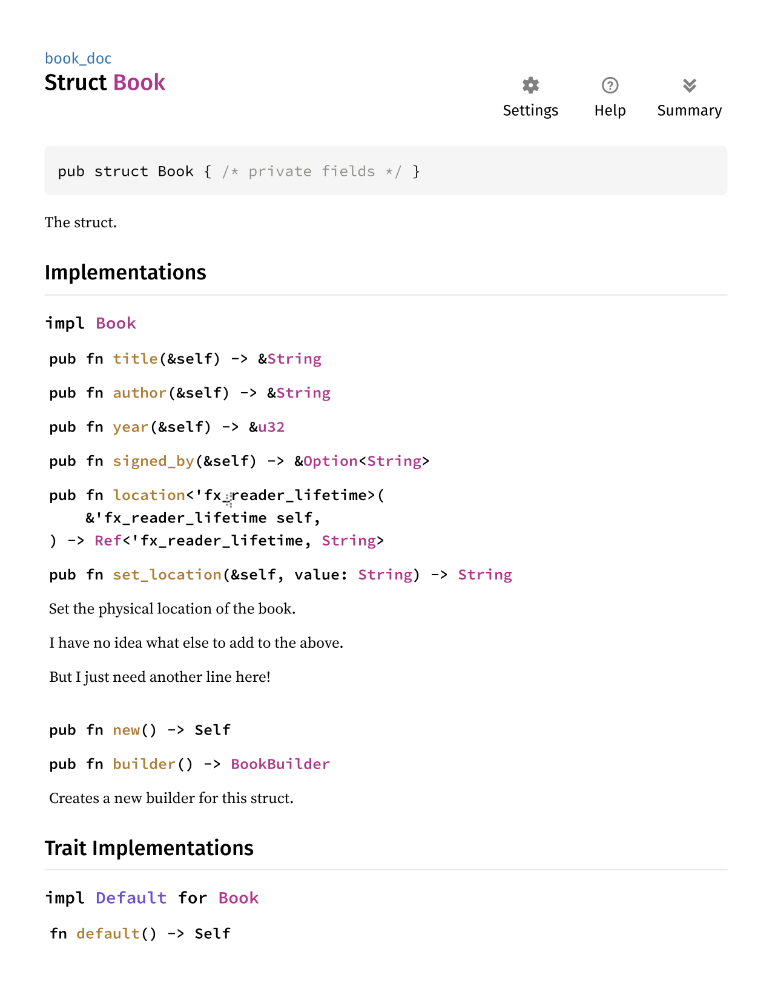
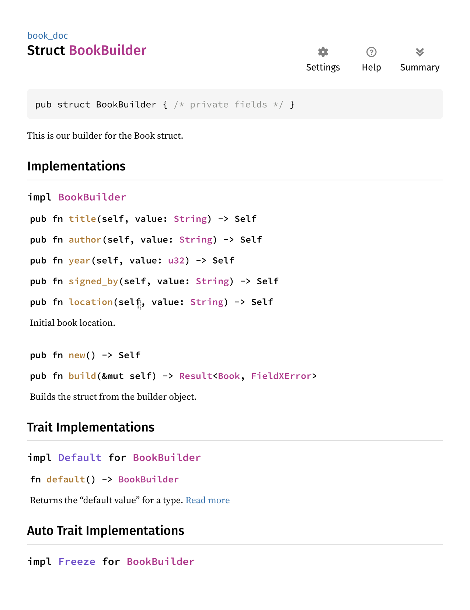

# Documentation

Documenting the generated entities could be challenging, if at all possible, unless specifically supported. FieldX provides such support by allowing you to use the `doc` argument. But before we get there, let's have a quick overlook of easier cases where the argument is not needed.

The most obvious case would be the struct itself. Cleared!

Then there are the fields. Their attached documentation is then used for the {{i:accessor}}s and builder {{i:setter method}}s.

Then what are we left with? The builder struct; the method `build()` of the builder implementation; the `builder()` method of the main struct; the {{i:setter}}s and the {{i:mutable accessor}}s; ... and so on! Quite a few, huh?

This is exactly where the `doc` argument comes to bind them all... It has a very simple syntax:

```rust ignore
doc(
    "This is line 1",
    "then there is line 2",
    "",
    "and we keep counting!"
)
```

Every string in the list is an individual line of documentation, ending with an implicit newline character. I.e., the above `doc` contains four lines of documentation; these make two paragraphs in the generated output. Since `doc` accepts any syntactically valid Rust literal string, the user is free to choose what they want to see between the brackets.

Let's see how it works in practice:

```rust ignore
{{#include ../../../examples/book_doc.rs:doc_decl}}
```

Check out the result (the methods `build()` and `builder()` are using the default documentation):

> > 
>
> > 
